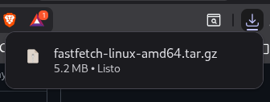
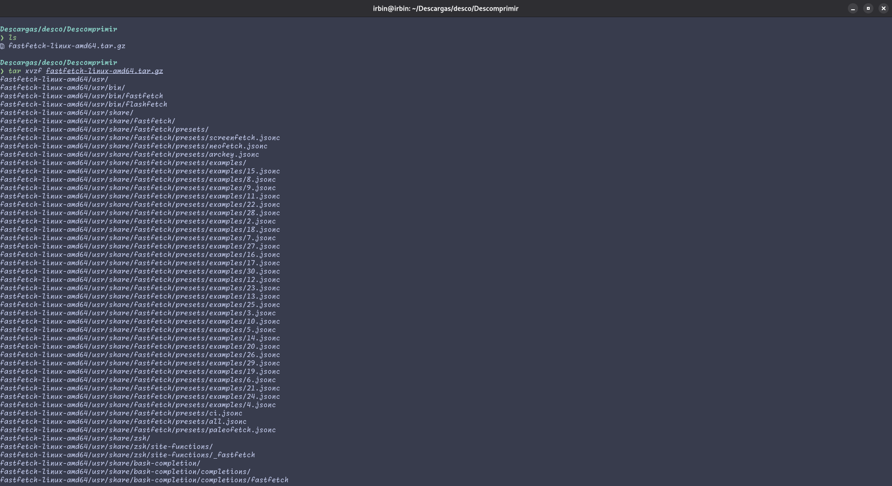
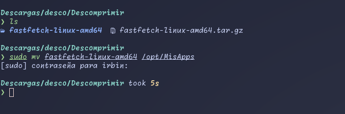
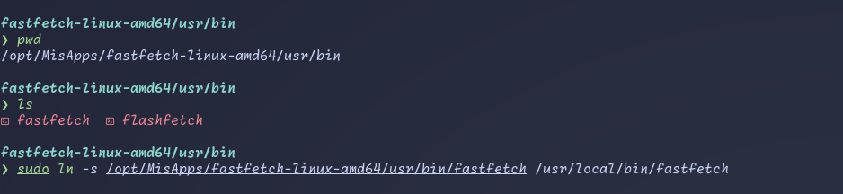

# Instalación manual de fasfetch
1. Descargar el [archivo](https://github.com/fastfetch-cli/fastfetch/releases) `fasfetch-linux-amd64.tar.gz`, no olvidar expandir las opciones(Show all 65 assets).  

2. Descomprimimos el archivo tar, existen varias formas de descomprimir un archivo, elije el que mas te acomode. En mi caso lo realizo desde la terminal, no te olvides de estar dentro del directorio donde se descargo el archivo tar.

3. Acabado las descompresión se creara una carpeta con el mismo nombre pero sin la extensión, esa carpeta la moveremos a `/opt/MisApps/`. Si bien se puede mover donde desee hasta puedes crear un archivo donde guardes programas similares, en mi caso dentro de `/opt` cree un carpeta `MisApps` por eso lo muevo ahí porque lo importante es hacer el enlace simbolico a `bin`.

4. Dentro de la carpeta fasfetch-linux-amd64 nos moveremos a `/usr/bin` porque aqui esta el binario que haremos un enlace simbolico para poder ejecutarlo desde cualquier ubicación donde estemos. Solo ejecutaremos lo siguiente:
```bash
sudo ln -s /opt/MisApps/fastfetch-linux-amd64/usr/bin/fastfetch /usr/local/bin/fastfetch
```


Listo con eso ya tienes instalado fasfetch de forma manual.
