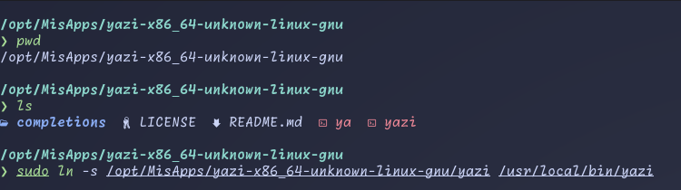

# Instalación Yazi
Para la instalación manual se sigue los mismos pasos que `fastfetch` que instalamos manualmente. Pero en este caso el archivo a descargar se llamara [`yazi-x86_64-unknown-linux-gnu.zip`](https://github.com/sxyazi/yazi/releases).

Ahora es un archivo `.zip` el cual se descomprime de la siguiente forma:
```bash
unzip yazi-x86_64-unknown-linux-gnu.zip
```
Después de descomprimir moveremos la carpeta a `/opt/MisApps/`, como menciono en el [tercer](./fastfetch.md) paso puedes ponerlo en cualquier parte.

Por último realizamos un enlace simbolico para poder ejecutarlo en cualquier ruta en que este en la terminal:
```bash
sudo ln -s /opt/MisApps/yazi-x86_64-unknown-linux-gnu/yazi /usr/local/bin/yazi
```


Estupendo, ahora ya tienes instalado yazi.
