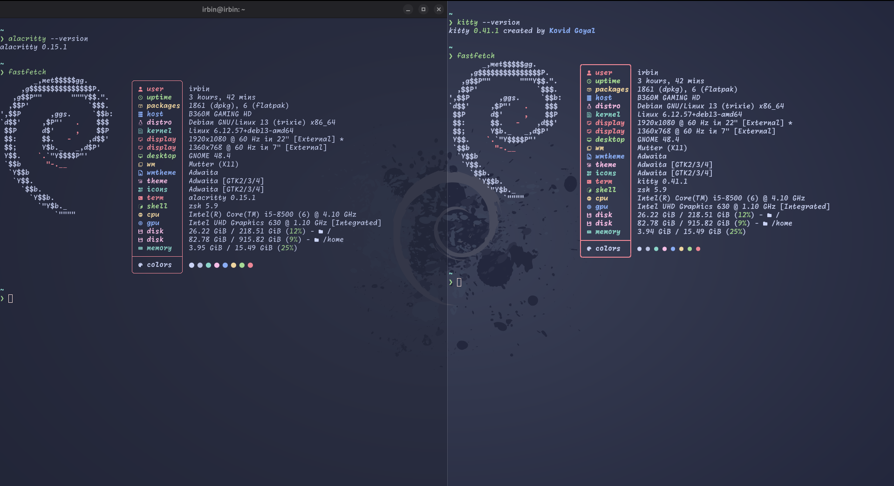
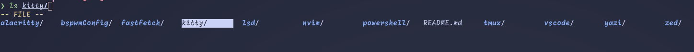
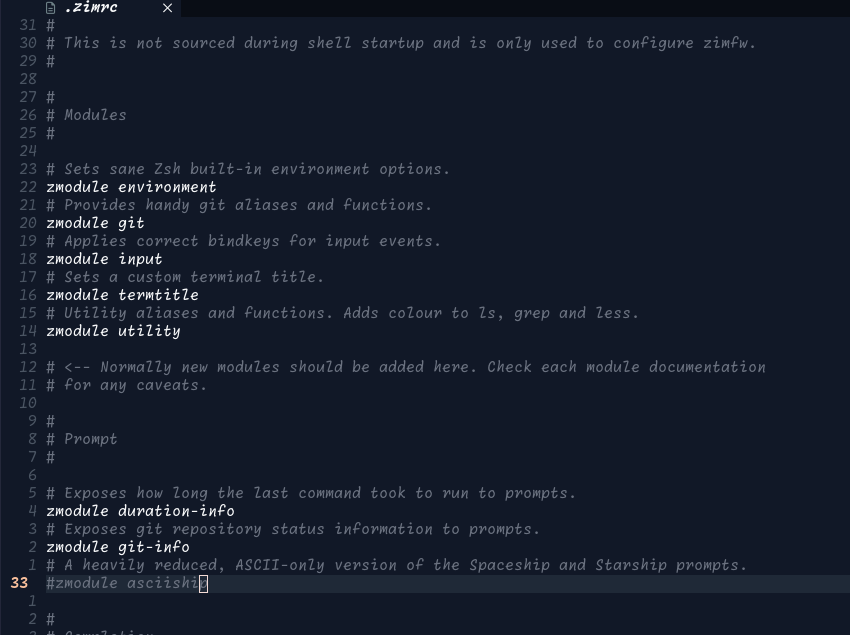
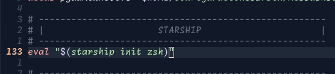
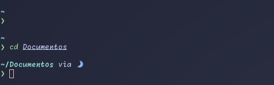
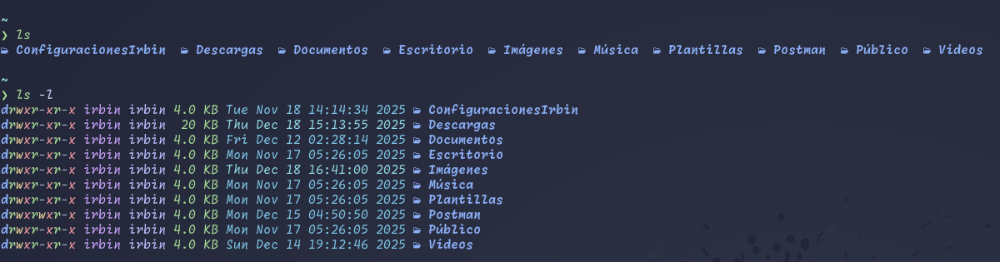
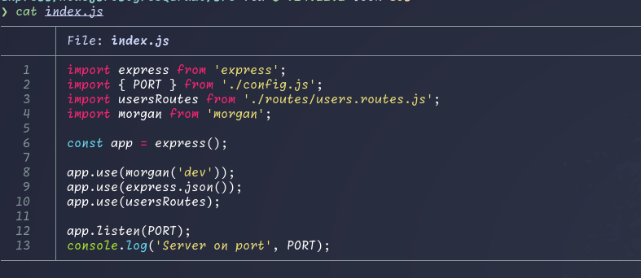
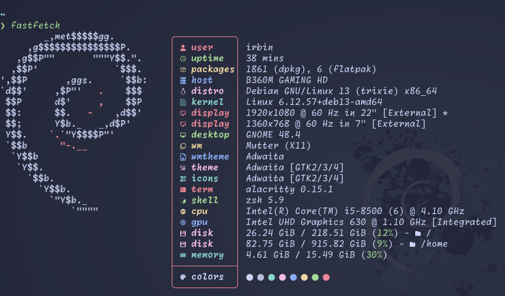
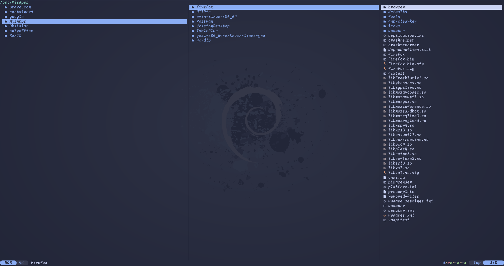
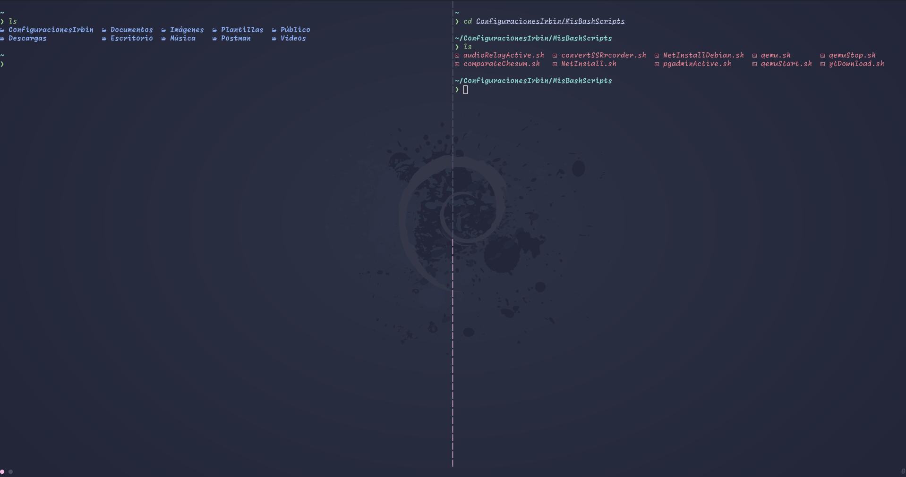

#  DOTFILES
Mi configuración de GNU/Linux para kitty, alacritty, neovim y más.
> Para esta configuración uso la Shell [zsh](https://zsh.sourceforge.io/)

## Terminal

Para instalar kitty o alacritty podemos hacerlo con su gestor de paquetes de sus sistema en mi caso es Debian:
* kitty: `sudo apt install kitty`
* Alacritty: `sudo apt install alacritty`

> Antes de copiar las configuraciones para `kitty` o `alacritty` debemos borrar el directorio alacritty o kitty dentro de `~/.config` si se encontrara.

Copiar los directorios kitty o alacritty de este repositorio a `~/.config`

## Instalar Shell ZSH

1. Instalar ZSH con su gestor de paquetes de su sistema
```bash
sudo apt install zsh
```

2. Ejecutamos `ZSH` desde la terminal escribiendo zsh y nos lanzara una lista de opciones para generar el archivo de configuración `.zshrc`. Como recien hemos instalado zsh elegiremos la opción de configuración vacía.  

3. Cambiar el shell bash a zsh por defecto
```bash
sudo usermod --shell /usr/bin/zsh root
sudo usermod --shell /usr/bin/zsh $USER
```

4. Reiniciamos el sistema o cerramos sessión.

### Marco de configuraciones ZSH
Si bien el marco más popular es [ohmyszsh](https://ohmyz.sh/) pero yo voy a usar [ZimFw](https://github.com/zimfw/zimfw) como marco para ZSH.
Para instalarlo haremos uso de `curl` o `wget`
```bash
curl -fsSL https://raw.githubusercontent.com/zimfw/install/master/install.zsh | zsh
```

```bash
wget -nv -O - https://raw.githubusercontent.com/zimfw/install/master/install.zsh | zsh
```

Con esto ya tendras un prompt con el tema ascciship, así como también autocompletado, etc.


Si bien zimfw trae por defecto un tema para el prompt yo instale un tema diferente para mi prompt el cual es [`starship`](https://starship.rs/) pero para instalarlo debemos de desintalar el tema por defecto de zimfw para ello debemos abrir el archivo de configuración de zimfw con su editor de texto favorito: `nvim ~/.zimrc`.

Dentro del archivo borrar o comentar la linea donde este `zmodule asciiship`, guardamos y cerramos el archivo.


En la terminal ejecutamos `zim uninstall` y con eso tendremos ya desinstalado el tema por defecto de zimfw, ahora pasaremos a instalar `starship` el cual en su [página](https://starship.rs/guide/#%F0%9F%9A%80-installation) nos da dos formas de instalarlo con el script o con su gestor de paquetes pero solo tiene para algunas distribuciones linux, en mi caso lo instale con apt pero si no estuviera tu gestor de paquetes para `starship` entonces use el script que se instala con curl.
```bash
curl -sS https://starship.rs/install.sh | sh
```

Luego de haber instalado `starship` tenemos que agregar dentro del archivo `.zshrc` el siguiente comando:
```bash
eval "$(starship init zsh)"
```



Listo al volver abrir la terminal nos aparecera algo como esto:



> Para saber más [comandos](https://zimfw.sh/docs/commands/) de zimfw visitar su web oficial

## LSD
Si quieres que tu terminal se vea asi cuando uses `ls`



Para tenerlo así entonces tenemos que instalar [LSD](https://github.com/lsd-rs/lsd)
```bash
sudo apt install lsd
```

Para que puedas usar `lsd` como `ls` debemos crear alias en .zshrc

```bash
alias ll='lsd -lh --group-dirs=first'
alias la='lsd -a --group-dirs=first'
alias l='lsd -l --group-dirs=first'
alias lla='lsd -lha --group-dirs=first'
alias ls='lsd --group-dirs=first'
```

Listo al abrir una terminal nueva ya puedes ver el efecto de `ls`

## BAT


Si con `LSD` habiamos mejorado el aspecto de `ls` también podemos hacer que `cat` mejore la forma como nos muestra la información, pasamos de un contenido gris a uno más colorido porque [BAT](https://github.com/sharkdp/bat) resalta de acuerdo al tipo de archivo que abre, esto es excelente en lenguajes de programación.

Su instalación es sencilla, por lo cual haremos uso del gestor de paquetes
```bahs
sudo apt install bat
```

Por último creamos el alias en .zshrc
```bash
alias cat='bat'
```

> En algunas distribuciones de linux el alias es con batcat. Por eso antes de realizar el alias probar diretamente con el comando bat o batcat en la terminal, solo abre un archivo con bat o batcat(`bat file.txt`)

## Fastfetch
Sabiendo que ahora neofetch quedo archivado, una alternativa es [fastfetch](https://github.com/fastfetch-cli/fastfetch). Fastfetch al igual que neofetch nos permite visualizar información del sistema de manera atractiva.

Fastfetch ya se encuentra dentro de los paquetes oficiales de muchas distribuciones linux pero si en caso no estuviera en tu distribución esta la forma manual que es por sus binarios, el cual es un [archivo](https://github.com/fastfetch-cli/fastfetch/releases) tar.
```bash
sudo apt install fastfetch
```
* En caso no te aparezca fastfetch en tu gestor de paquetes [aquí](./.resources/fastfetch.md) te muestro como instalarlo manualmente

Para que fasfetch se vea como esto:

Debemos copiar el directorio fasfetch de este repositorio a `~/.config`(primero serciorate que no exista la carpeta fasfetch).

## Yazi


Si te gusta moverte por la terminal entonces yazi es tu mejor aliado porque te permite copiar, mover, borrar y más.

Su instalación es de forma manual pero en algunas distribuciones linux si se permiten a traves de su gestor de paquetes, en mi caso si lo hize de forma manual. [Aquí](./.resources/yazi.md) te muestro como es la instalación.

## Tmux

En alacritty no se puede dividir la terminal para ejeuctar diferentes comandos a la vez, cosa que en kitty si se puede, a esto se le llama multiplexor, pero para poder usarlo en alacritty hacemos uso de tmux el cual nos permitira hacer dicha función.  
Su instalación desde cualquier gestor de paquetes, claro esta si no estuviere hacemos la instalación manual la cual es igual a como lo hicimos con [`fasfetch`](/.resources/fastfetch.md) o [`yazi`](/.resources/yazi.md).
```bash
sudo apt install tmux
```

Ahora solo falta copiar mi configuración de este repositorio a `~/.config`(no olvidar serciorarse que no exista tmux).  
Con eso tienes tmux completamente instaldo y configurado.
