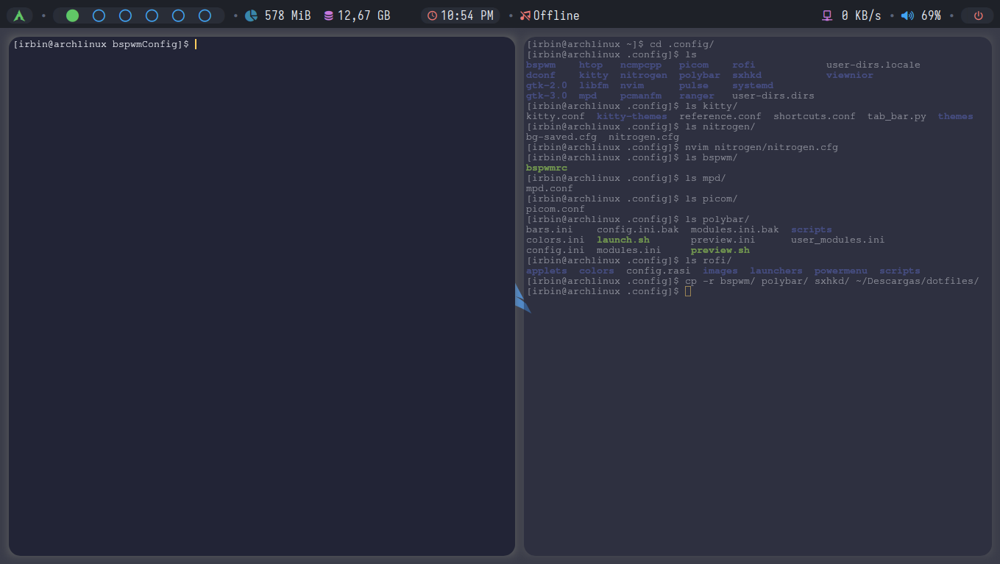
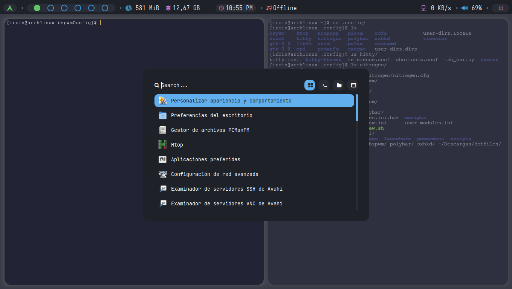
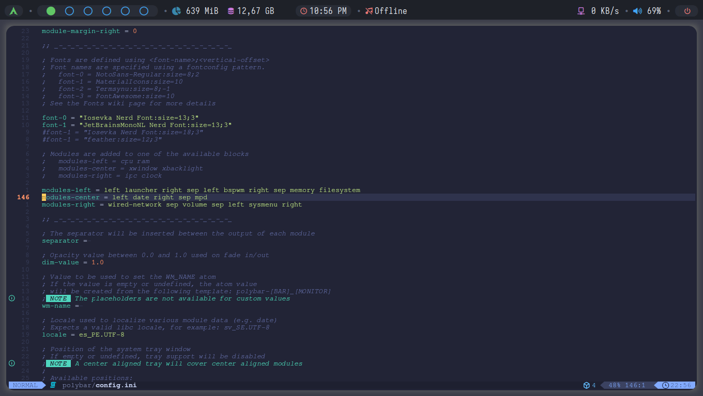

# Configuración del entorno BSPWM
En este entorno se utilizo las siguientes aplicaciones:  
- BSPWM
- kitty
- lazy.vim
- mpd
- ncmpcpp
- neovim
- pcmanfm
- picom
- polybar
- rofi y rofi themes
- sxhkd

> Faltan las configuraciones de mpd y ncmpcpp

## Entorno BSPWM

## Polybar

