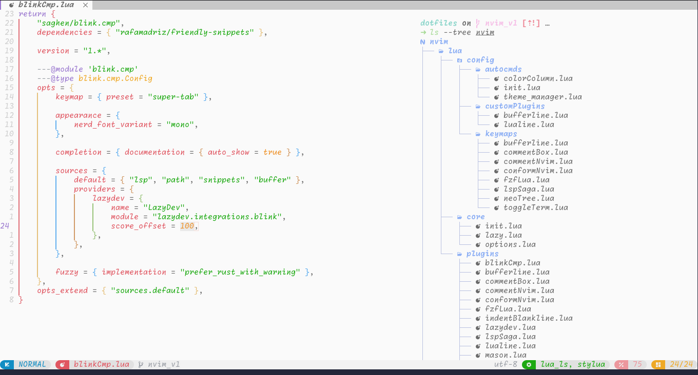
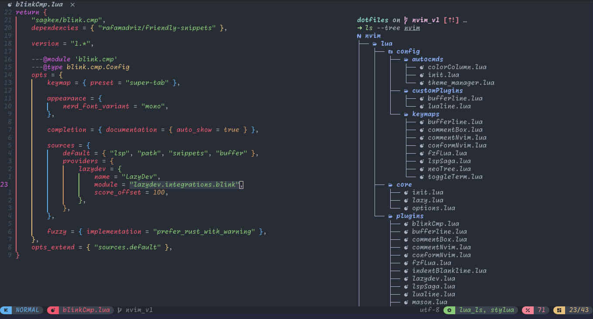
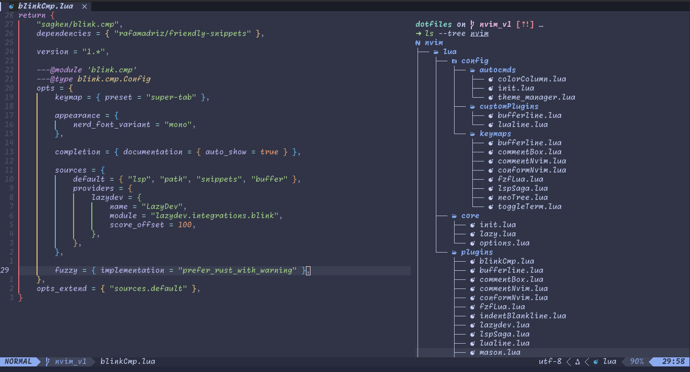
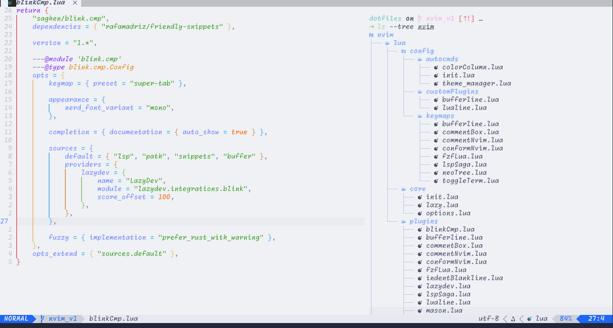
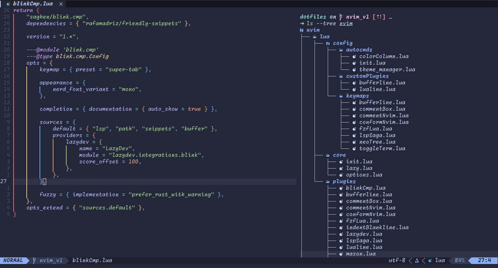
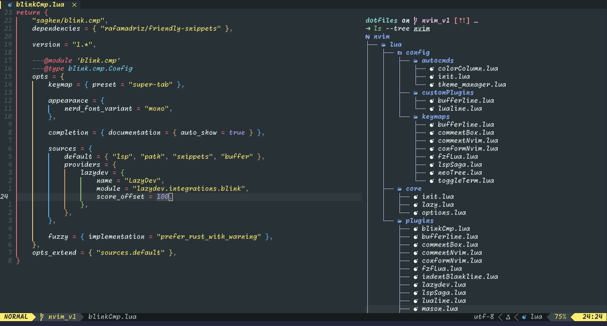
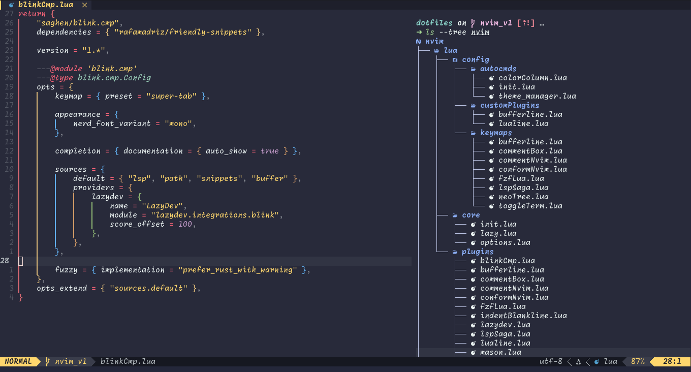
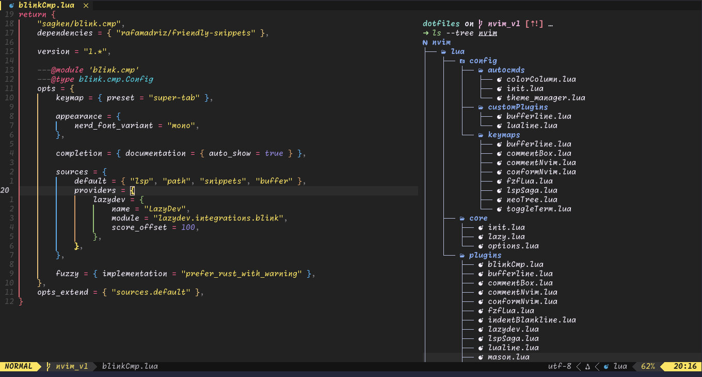
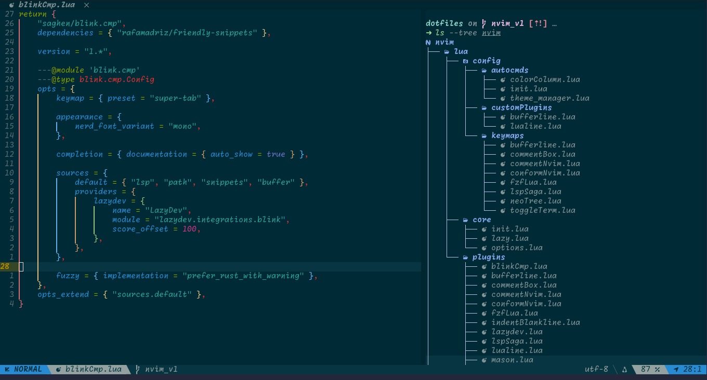

# Mi configuración de neovim

## Requerimientos
* `Nightly`:

    Necesario para buscador difuso de blim.cmp, se debe instalar rustup para poder instalar nightly(`rustup install nightly`).
    Podemos poner a nightly pro default o hacer lo siguiente apara que solo nuestra configuración lo utilize para que compile el buscador difuso en la instalación de blink.cmp:
    ~~~
    cd ~/.config/nvim
    rustup override set nightly
    ~~~

* `xclip`

    Necesario para que neovim pueda acceder al portapapeles del sistema permitiendo así copiar/pegar contenido entre neovim y otras aplicaciones
* `nodejs, npm`

    Necesario para instalación de servidores lsp
* `gcc`

    Utilizado en nvim-treesitter en la compilación de parsers
* `ripgrep`

    Necesario para las búsquedas con fzfLua live_grep

## Temas
### Onedark Pro

|Onedark|Onedark Dark| 
|---|---| 
|| |

|Onedark Light|Onedark Vivid|
|---|---|
|||

### Catppuccin

|Frappe|Latte|
|---|---|
|||

|Macchiato|Mocha|
|---|---|
|||

### Monokai Pro

|Light|Machine|
|---|---|
|||

|Octagon|Ristretto|
|---|---|
|||

|Spectrum | 
|---|
||
### Solarized

|Solarized | 
|---|
||

### Gruvbox

|Gruvbox| 
|---|
||

### Tundra

|Tundra | 
|---|
||

# Demo

# Install
~~~bash
git clone --depth 1 https://gitlab.com/irbinr1/dotfiles.git ~/.config/nvim && rm -rf ~/.config/nvim/resources && nvim
~~~

# Unistall
~~~bash
rm -rf ~/.config/nvim
rm -rf ~/.local/state/nvim
rm -rf ~/.local/share/nvim
~~~

